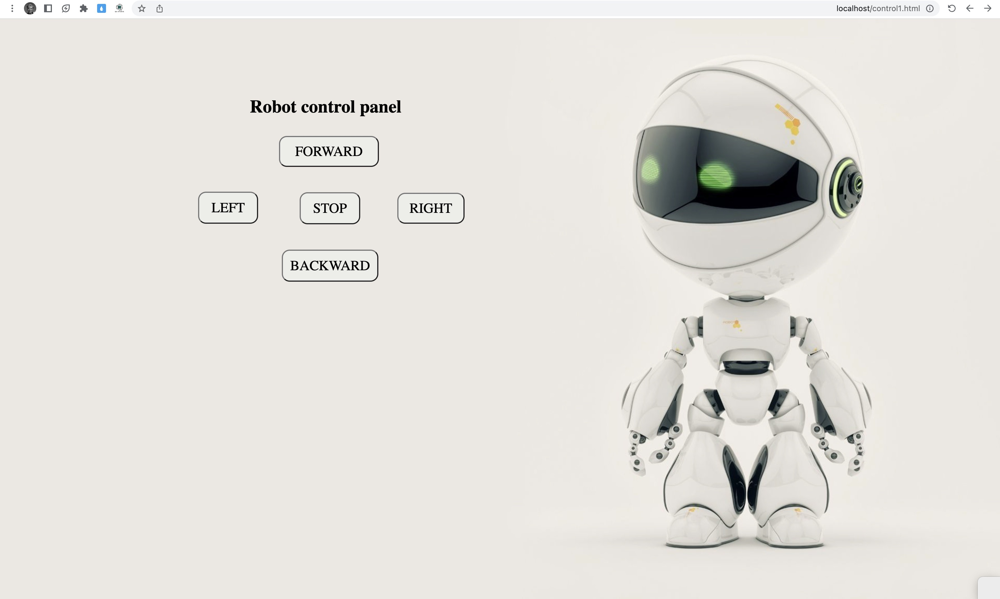

# Robot_control
In the first task, a web page was created to control the robot movement direction, store the direction in the database, and display the last stored value in another page.

Robot directions control pag

